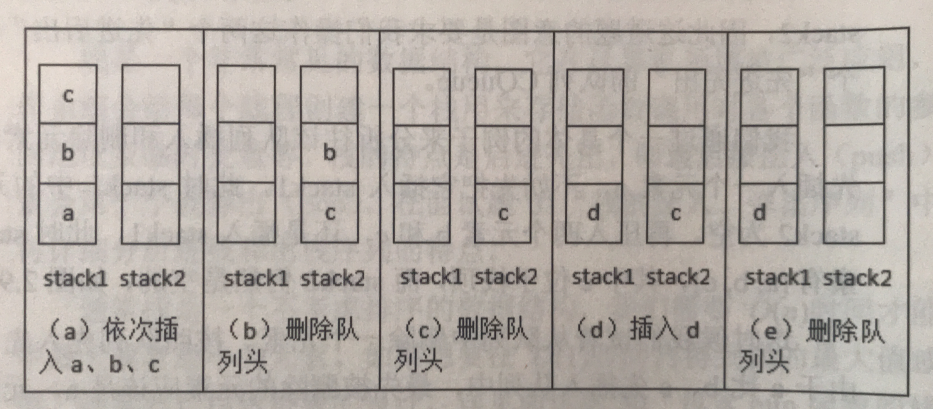

## [剑指 Offer 09. 用两个栈实现队列](https://leetcode-cn.com/problems/yong-liang-ge-zhan-shi-xian-dui-lie-lcof/)

### 解法1

​		队列的特性是先入先出，栈的特性的先入后出。先想到的方法是入栈采用两个循环：入栈的时候将A栈中的元素依次弹出并压入B栈中，将元素压入A栈再将B栈中的元素依次弹出再压入A栈。显然这种方法的时间复杂度并不好，在Leetcode运行时间为`377ms`。出队列只需要将A栈顶的元素弹出即可。

````java
class CQueue09_01 {
    private Stack<Integer> main = new Stack<>();
    private Stack<Integer> temp = new Stack<>();

    public CQueue09_01() {

    }

    public void appendTail(int value) {
        if (main.size() == 0) {
            main.push(value);
            return;
        }
        while (main.size() > 0) {
            //清空main中的元素
            temp.push(main.pop());
        }
        main.push(value);
        while (temp.size() > 0) {
            main.push(temp.pop());
        }
    }

    public int deleteHead() {
        if (main.size() == 0) return -1;
        return main.pop();
    }
}

/**
 * Your CQueue object will be instantiated and called as such:
 * CQueue obj = new CQueue();
 * obj.appendTail(value);
 * int param_2 = obj.deleteHead();
 */
````

### 解法2

​		解法1使用两个循环实现的队列功能，如果在频繁插入元素的时候性能就会非常差。接下来从出队列入手，干掉一个循环。

​		入队列的时候只需要将元素压入A栈；出队列的时候判断A栈和B栈是否为空，如果为空则返回-1。如果B栈为空而A栈中有元素则依次将A栈元素弹出并压入B栈，再弹出B栈栈顶的元素。如果B栈不为空，则直接弹出B栈栈顶元素。这种方法在Leetcode的执行时间为`56ms`。



（图片来自《剑指Offer》）

````java
class CQueue09_02 {
    private Stack<Integer> main = new Stack<>();
    private Stack<Integer> temp = new Stack<>();
    public CQueue09_02() {

    }

    public void appendTail(int value) {
        main.push(value);
    }

    public int deleteHead() {
        if(main.size() == 0 && temp.size() == 0) return -1;
        if(temp.size() == 0){
            while (main.size() != 0){
                temp.push(main.pop());
            }
            return temp.pop();
        }else{
            return temp.pop();
        }
    }
}

/**
 * Your CQueue object will be instantiated and called as such:
 * CQueue obj = new CQueue();
 * obj.appendTail(value);
 * int param_2 = obj.deleteHead();
 */
````

